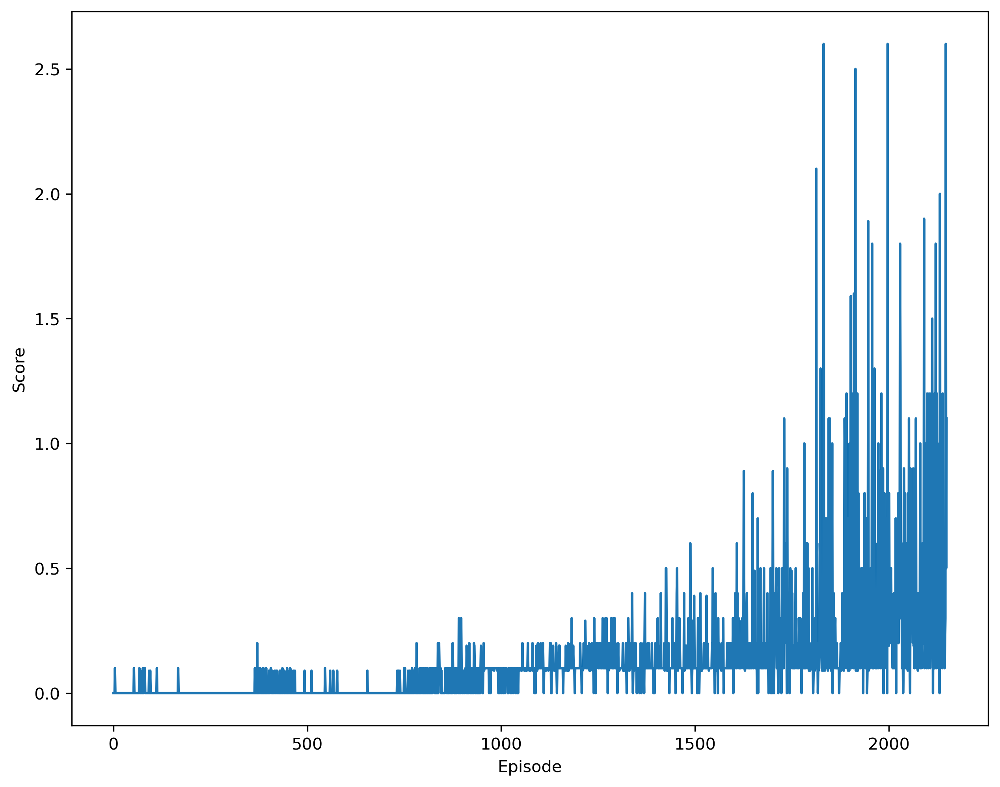

# Environment

In this environment, two agents control rackets to bounce a ball over a net. If an agent hits the ball over the net, it receives a reward of +0.1. If an agent lets a ball hit the ground or hits the ball out of bounds, it receives a reward of -0.01. Thus, the goal of each agent is to keep the ball in play.

The observation space consists of 8 variables corresponding to the position and velocity of the ball and racket. Each agent receives its own, local observation. Two continuous actions are available, corresponding to movement toward (or away from) the net, and jumping.

The task is episodic, and in order to solve the environment, your agents must get an average score of +0.5 (over 100 consecutive episodes, after taking the maximum over both agents). Specifically,

* After each episode, we add up the rewards that each agent received (without discounting), to get a score for each agent. This yields 2 (potentially different) scores. We then take the maximum of these 2 scores.
* This yields a single score for each episode.

The environment is considered solved, when the average (over 100 episodes) of those scores is at least +0.5.

The environment used in this project is adopted from Tennis environment of [Unity ML-Agents](https://github.com/Unity-Technologies/ml-agents). To run the environment, user don't need to install the Unity, but download the environment configuration files from [here](https://github.com/udacity/deep-reinforcement-learning/tree/master/p3_collab-compet).

# Dependence

This project is build on Python 3.6. Following dependencies are required:

* unityagents==0.4.0
* torch==1.4.0
* tensorflow==1.7.1
* numpy>=1.11.0

# Instruction

* `Tennis.ipynb`: the driving file to set up the environment and train the agents with MADDPG (Multi-agent Deep Deterministic Policy Gradient)
* `maddpg_agent.py`: define MADDPG Agent class
* `ddpg_agent.py`: define DDPG Agent class
* `buffer.py`: define Replay Buffer
* `networkforall.py`: define neural netowrk architecture (both actor and critic) for MADDPG algorithm

# Results

The plot of maximum (over the 2 agents) accumulated scores is shown as below,

